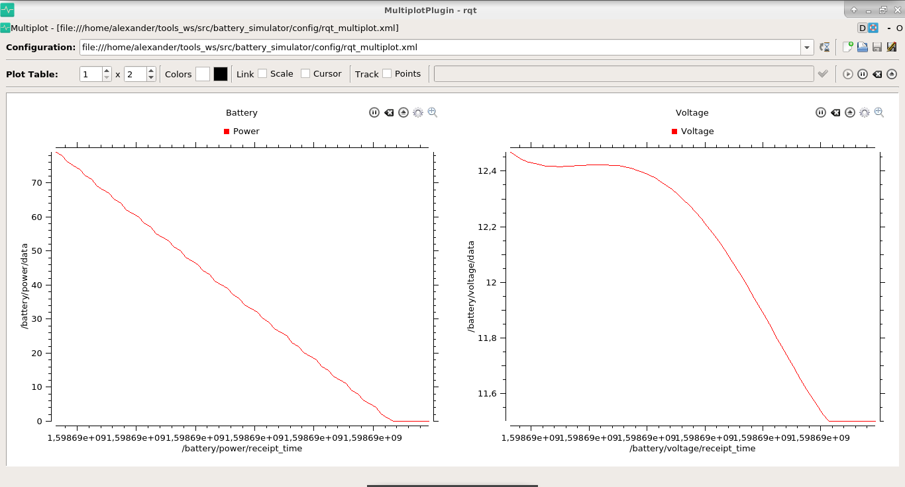

# battery_simulator
A ROS package for battery simulation

## Install

To install this package enter your catkin workspace, clone this repository and compile the workspace

```bash
cd ~/catkin_ws/src
git clone https://github.com/AlexanderSilvaB/battery_simulator.git
cd ..
catkin_make
```

## Use
Only one line is required to use the package
```xml
<node pkg="battery_simulator" type="battery" name="battery"/>
```

You can also set the parameters of the node to match your project specifications, e.g.
```xml
<node pkg="battery_simulator" type="battery" name="battery">
    <param name="discharge_model" value="invert" />
</node>
```

There are two examples available in launch directory:
1. fast: A hypotetical battery that can charge and recharge really fast, usefull to test the package. This exemplo also launchs a plot (rqt_multiplot needed).
2. p3dx: This example creates a node that simulates the Pioneer 3-DX with the three batteries connected.

To run any example is is only needed to launch the example files from your catkin workspace.

```bash
cd ~/catkin_ws/src
source devel/setup.bash

roslaunch battery_simulator fast.launch
or
roslaunch battery_simulator p3dx.launch
```

## Topics
At every second the battery node publishes to three topics related to the battery, being them: 
* power: The battery power
* voltage: The voltage of the battery
* percent: The voltage of the battery as a percent value (0-100) 
* recharging: A boolean indicating if the battery is recharging

The node also subscribes to the following topics:
* recharge: Expects a boolean to control the recharge of the battery (the current provided by the charger is configured in the node parameters)

## Parameters

* ~discharge_model (string, default: exponential)
  * The discharge model of the battery, it can be exponential, linear and invert
* ~max_voltage (float, default: 12.5V)
  * The maximum voltage in the battery
* ~min_voltage (float, default: 11.5V)
  * The minimum voltage in the battery
* ~base_voltage (float, default: 12.0V)
  * The base voltage of the battery (used for power calculus)
* ~initial_percent (int, default: 100%)
  * This is the percent of charge of the battery at launch time
* ~discharge_current (int, default: 7000mAh)
  * The maximum current the battery can provide to the robot
* ~recharge_current (int, default: 2400mAh)
  * The maximum current the charger can provide to the battery
* ~base_power_consumption (int, default: 200mAh)
  * The average current used by the robot when it is not moving (motors disabled)
* ~motors_power_consumption (int, default: 5000mAh)
  * The average current used by the robot when it is moving (motors enabled)
* ~num_batteries (int, default: 1)
  * This is the number os batteries the robot have. The maximum current the robot can use is the discharge_current multiplied by the number of batteries.
* ~cmd_vel_topic (string, default: /cmd_vel)
  * This is the topic that the node will subscribe to get the robot velocity and calculates the power consumption.
* ~verbose (bool, default: false)
  * When setted to true, the node will show the battery status at every second.

## TO-DO
- [ ] Better models for the battery

## Screenshots
#### Fast battery example
